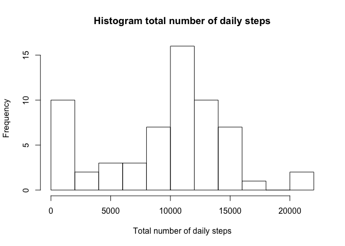
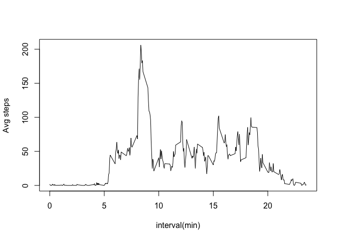
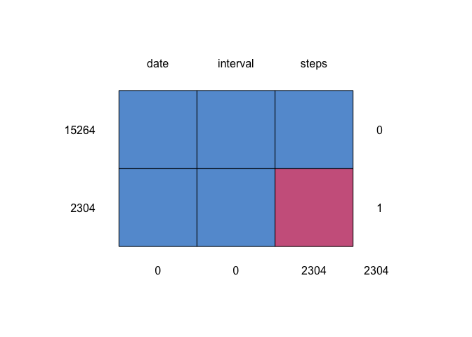
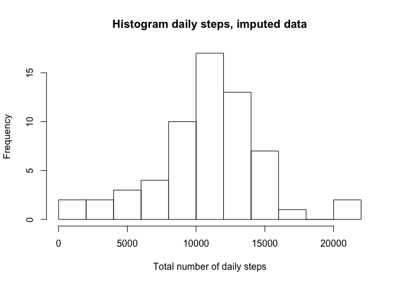
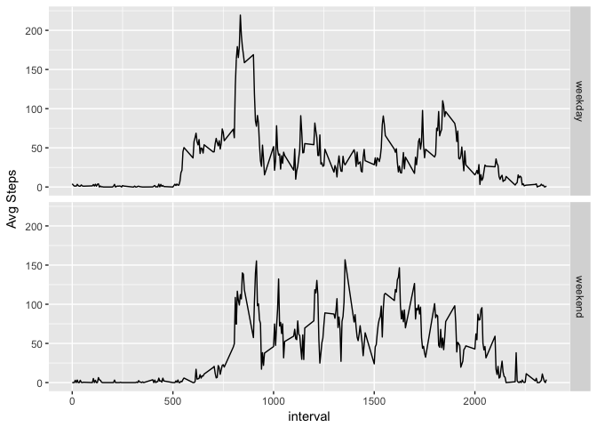

## Loading and preprocessing the data

```r
data <- read.csv(file="activity.csv", colClasses = c("numeric","character", "numeric"))
head(data)
```

```
##   steps       date interval
## 1    NA 2012-10-01        0
## 2    NA 2012-10-01        5
## 3    NA 2012-10-01       10
## 4    NA 2012-10-01       15
## 5    NA 2012-10-01       20
## 6    NA 2012-10-01       25
```

```r
data$date <- as.Date(data$date,"%Y-%m-%d")
```

## Histogram and Mean total number of steps taken per day

```r
dailySteps <- with(data,aggregate(steps,by=list(date=data$date), sum,na.rm = T))
AvgDailySteps <- mean(dailySteps$x)
MedianDailySteps <- median(dailySteps$x)
hist(dailySteps$x, main = "Histogram total number of daily steps", xlab = "Total number of daily steps", breaks =10)
```

<!-- -->

The median number of steps taken daily is: 10395

The mean number of steps taken daily is: 9354

## The average daily activity pattern

```r
dailyPattern <- with(data,aggregate(steps,by=list(interval=data$interval), mean,na.rm = T))
maxInterval=dailyPattern$interval[which.max(dailyPattern$x)]
dailyPattern$interval=dailyPattern$interval/100
with(dailyPattern, plot(interval, x, xlab= "interval(min)", ylab="Avg steps", type="l"))
```

<!-- -->

Maximum steps interval is: 8 : 35 


## Imputing missing values

Total Number of rows that have NA data: 2304
All the NA data is in steps column.
Imputing the data:

```r
NumNARows <- sum(complete.cases(data)==0)
library(mice)
```

```
## Loading required package: lattice
```

```
## 
## Attaching package: 'mice'
```

```
## The following objects are masked from 'package:base':
## 
##     cbind, rbind
```

```r
md.pattern(data, plot=T)
```

<!-- -->

```
##       date interval steps     
## 15264    1        1     1    0
## 2304     1        1     0    1
##          0        0  2304 2304
```

```r
imputedData <- mice(data, method="pmm",m=1)
```

```
## 
##  iter imp variable
##   1   1  steps
##   2   1  steps
##   3   1  steps
##   4   1  steps
##   5   1  steps
```

```r
completeData <- complete(imputedData,1)
```

Calculate average and median daily steps and show the histogram:


```r
dailyStepsC <- with(completeData,aggregate(steps,by=list(date=data$date), sum,na.rm = T))
AvgDailyStepsC <- mean(dailyStepsC$x)
MedianDailyStepsC <- median(dailyStepsC$x)

hist(dailyStepsC$x, xlab = "Total number of daily steps", breaks =10, main = "Histogram daily steps, imputed data")
```

<!-- -->


The median number of steps taken daily (imputed) is: 10600

The mean number of steps taken daily (imputed) is: 10716

The median is the same as the original data, but the mean has changenged slightly.


## Are there differences in activity patterns between weekdays and weekends?

Check which dates are a weekday and ones are weeked days:

```r
isweekend <- as.factor(weekdays(completeData$date) %in% c("Saturday","Sunday"))
newData <- cbind(completeData,isweekend)
avg_weekday <- aggregate(newData$steps,by=list(isweekend=newData$isweekend, interval=newData$interval),mean)
avg_weekday$wday <-factor(avg_weekday$isweekend,labels = c("weekday","weekend"))
```

Plot the average number of steps for weed days and weekend days.


```r
library(ggplot2)
g <- ggplot(avg_weekday,aes(interval,x))
g+geom_line()+facet_grid(avg_weekday$wday~.)+labs(y="Avg Steps")
```

<!-- -->
